# 🌐 Junos Push Configuration Tool

A comprehensive Juniper network automation tool for pushing configurations to device groups with consistency checks and safety features.

## 📋 Table of Contents

- [Features](#-features)
- [Workflow](#-workflow)
- [Prerequisites](#-prerequisites)
- [Installation](#-installation)
  - [Windows Installation](#windows-installation)
  - [Linux Installation](#linux-installation)
- [Configuration](#-configuration)
- [Usage](#-usage)
- [Examples](#-examples)
- [Advanced Features](#-advanced-features)
- [Troubleshooting](#-troubleshooting)
- [Contributing](#-contributing)

## 🌊 Workflow

```mermaid
flowchart LR
    %% Advanced Custom Styles
    classDef startNode fill:#667eea,stroke:#764ba2,stroke-width:4px,color:#fff,font-weight:bold,font-size:16px
    classDef endNode fill:#f093fb,stroke:#f5576c,stroke-width:4px,color:#fff,font-weight:bold,font-size:16px
    classDef initProcess fill:#4facfe,stroke:#00f2fe,stroke-width:3px,color:#fff,font-weight:600
    classDef validationProcess fill:#43e97b,stroke:#38f9d7,stroke-width:3px,color:#fff,font-weight:600
    classDef executionProcess fill:#fa709a,stroke:#fee140,stroke-width:3px,color:#fff,font-weight:600
    classDef operationProcess fill:#ff9a9e,stroke:#fecfef,stroke-width:3px,color:#333,font-weight:600
    classDef compareProcess fill:#a8edea,stroke:#fed6e3,stroke-width:3px,color:#333,font-weight:600
    classDef reportProcess fill:#667eea,stroke:#764ba2,stroke-width:3px,color:#fff,font-weight:600
    classDef decisionDiamond fill:#ffecd2,stroke:#fcb69f,stroke-width:4px,color:#333,font-weight:bold
    classDef criticalDecision fill:#ff8a80,stroke:#ff5722,stroke-width:4px,color:#fff,font-weight:bold
    
    %% Main Flow Structure
    subgraph INIT ["🚀 INITIALIZATION PHASE"]
        direction TB
        START([🎯 START<br/>SYSTEM]) --> CLI[📋 CLI PARSER<br/>group, config-file<br/>operation]
        CLI --> CONFIG[⚙️ CONFIG LOADER<br/>Load Settings<br/>Device Groups<br/>config.ini]
    end
    
    subgraph PRECHECK ["🛡️ VALIDATION & PRE-FLIGHT"]
        direction TB
        COMPARE_CHECK{🔍 COMPARE<br/>OPERATION?}
        VALIDATE[🧹 CONFIG<br/>VALIDATOR<br/>Syntax Check<br/>Rule Validation]
        SSH_TEST[🔌 SSH<br/>CONNECTIVITY<br/>Test All Devices<br/>Timeout Check]
        PENDING_CHECK[⚙️ DEVICE<br/>STATUS CHECK<br/>Pending Configs<br/>Uncommitted Changes]
        EXISTS_CHECK[📊 CONFIG<br/>EXISTENCE CHECK<br/>Already Applied?<br/>Duplicate Detection]
        
        COMPARE_CHECK -- No --> VALIDATE
        VALIDATE --> SSH_TEST
        SSH_TEST --> PENDING_CHECK
        PENDING_CHECK --> EXISTS_CHECK
    end
    
    subgraph COMPARE_FLOW ["🔄 COMPARISON WORKFLOW"]
        direction TB
        COMPARE_SSH[🔌 DUAL SSH<br/>CONNECTION<br/>Device A + B<br/>Parallel Connect]
        RETRIEVE_CONFIG[📥 CONFIG<br/>RETRIEVAL<br/>Running Configs<br/>Real-time Fetch]
        DIFF_ANALYSIS[🔍 DIFFERENCE<br/>ENGINE<br/>Filter Ignored<br/>Generate Diff]
        
        COMPARE_CHECK -- Yes --> COMPARE_SSH
        COMPARE_SSH --> RETRIEVE_CONFIG
        RETRIEVE_CONFIG --> DIFF_ANALYSIS
    end
    
    subgraph EXECUTION ["⚡ EXECUTION ENGINE"]
        direction TB
        DRY_RUN{🧪 DRY RUN<br/>MODE?}
        PARALLEL_CHECK{🔄 PARALLEL<br/>EXECUTION?}
        PARALLEL_EXEC[🚀 PARALLEL<br/>PROCESSOR<br/>Simultaneous<br/>Both Devices]
        SEQUENTIAL_EXEC[📝 SEQUENTIAL<br/>PROCESSOR<br/>Ordered Execution<br/>One by One]
        DEVICE_OP[🎯 DEVICE<br/>OPERATION<br/>Execute Command<br/>Monitor Status]
        
        EXISTS_CHECK --> DRY_RUN
        DRY_RUN -- Execute --> PARALLEL_CHECK
        PARALLEL_CHECK -- Yes --> PARALLEL_EXEC
        PARALLEL_CHECK -- No --> SEQUENTIAL_EXEC
        PARALLEL_EXEC --> DEVICE_OP
        SEQUENTIAL_EXEC --> DEVICE_OP
    end
    
    subgraph OPERATIONS ["🎛️ CORE OPERATIONS HUB"]
        direction TB
        OP_ROUTER{🎛️ OPERATION<br/>TYPE}
        CHECK_OP[🔍 COMMIT<br/>CHECK<br/>Validation Only<br/>Impact Analysis]
        COMMIT_OP[🔒 STANDARD<br/>COMMIT<br/>Lock Load Commit<br/>Immediate Apply]
        CONFIRMED_OP[⏰ CONFIRMED<br/>COMMIT<br/>Lock Load Commit<br/>5-min Confirmation<br/>Auto-rollback Safety]
        ROLLBACK_OP[↩️ ROLLBACK<br/>OPERATION<br/>Convert SET to DELETE<br/>Restore Previous State]
        
        DEVICE_OP --> OP_ROUTER
        OP_ROUTER -- check --> CHECK_OP
        OP_ROUTER -- commit --> COMMIT_OP
        OP_ROUTER -- commit-confirmed --> CONFIRMED_OP
        OP_ROUTER -- rollback --> ROLLBACK_OP
    end
    
    subgraph REPORTING ["📊 REPORTING & OUTPUT"]
        direction TB
        DRY_DISPLAY[📋 DRY-RUN<br/>PREVIEW<br/>Execution Plan<br/>Impact Summary<br/>Risk Assessment]
        RESULTS_TABLE[📈 RESULTS<br/>DASHBOARD<br/>Success Status<br/>Performance Metrics<br/>Detailed Logs<br/>Error Summary]
        FINISH([🏁 PROCESS<br/>COMPLETE])
        
        DRY_RUN -- Yes --> DRY_DISPLAY
        CHECK_OP --> RESULTS_TABLE
        COMMIT_OP --> RESULTS_TABLE
        CONFIRMED_OP --> RESULTS_TABLE
        ROLLBACK_OP --> RESULTS_TABLE
        DIFF_ANALYSIS --> RESULTS_TABLE
        DRY_DISPLAY --> FINISH
        RESULTS_TABLE --> FINISH
    end
    
    %% Enhanced Connection Flow
    CONFIG --> COMPARE_CHECK
    
    %% Apply Advanced Styling
    class START startNode
    class FINISH endNode
    class CLI,CONFIG initProcess
    class VALIDATE,SSH_TEST,PENDING_CHECK,EXISTS_CHECK validationProcess
    class PARALLEL_EXEC,SEQUENTIAL_EXEC,DEVICE_OP executionProcess
    class CHECK_OP,COMMIT_OP,CONFIRMED_OP,ROLLBACK_OP operationProcess
    class COMPARE_SSH,RETRIEVE_CONFIG,DIFF_ANALYSIS compareProcess
    class DRY_DISPLAY,RESULTS_TABLE reportProcess
    class COMPARE_CHECK,PARALLEL_CHECK decisionDiamond
    class DRY_RUN,OP_ROUTER criticalDecision
    
    %% Advanced Subgraph Styling
    style INIT fill:#e3f2fd,stroke:#1976d2,stroke-width:4px,color:#000
    style PRECHECK fill:#e8f5e8,stroke:#388e3c,stroke-width:4px,color:#000
    style COMPARE_FLOW fill:#e1f5fe,stroke:#0277bd,stroke-width:4px,color:#000
    style EXECUTION fill:#fff3e0,stroke:#f57c00,stroke-width:4px,color:#000
    style OPERATIONS fill:#ffebee,stroke:#d32f2f,stroke-width:4px,color:#000
    style REPORTING fill:#f3e5f5,stroke:#7b1fa2,stroke-width:4px,color:#000

```



## 🔧 Prerequisites

- Python 3.8 or higher
- Network access to Juniper devices
- SSH access to target devices
- Administrative privileges on target devices

## 📦 Installation

### Windows Installation

#### Step 1: Install Python

1. **Download Python** from [python.org](https://www.python.org/downloads/windows/)
   - Choose Python 3.8 or later
   - ⚠️ **Important**: Check "Add Python to PATH" during installation

2. **Verify Python installation** by opening Command Prompt (`cmd`) and running:
   ```cmd
   python --version
   pip --version
   ```

#### Step 2: Install UV (Python Package Manager)

```cmd
# Install UV using pip
pip install uv

# Verify UV installation
uv --version
```

#### Step 3: Clone and Setup the Project

```cmd
# Clone the repository (or download and extract)
git clone <repository-url>
cd junos_push_configuration

# Create virtual environment and install dependencies
uv sync

# Activate the virtual environment
.venv\Scripts\activate

# Install the tool in development mode
uv pip install -e .
```

#### Step 4: Verify Installation

```cmd
# Test the tool
junos-push --help
```

### Linux Installation

#### Step 1: Install Python

**Ubuntu/Debian:**
```bash
# Update package list
sudo apt update

# Install Python and pip
sudo apt install python3 python3-pip python3-venv git

# Verify installation
python3 --version
pip3 --version
```

**CentOS/RHEL/Rocky Linux:**
```bash
# Install Python and git
sudo dnf install python3 python3-pip git

# Or for older versions:
# sudo yum install python3 python3-pip git

# Verify installation
python3 --version
pip3 --version
```

**Arch Linux:**
```bash
# Install Python and git
sudo pacman -S python python-pip git

# Verify installation
python --version
pip --version
```

#### Step 2: Install UV (Python Package Manager)

```bash
# Install UV using pip
pip3 install uv

# Add local bin to PATH if needed
echo 'export PATH="$HOME/.local/bin:$PATH"' >> ~/.bashrc
source ~/.bashrc

# Verify UV installation
uv --version
```

#### Step 3: Clone and Setup the Project

```bash
# Clone the repository or download
git clone https://github.com/TheNetworker/junos_push_configuration.git
cd junos_push_configuration

# Create virtual environment and install dependencies
uv sync

# Activate the virtual environment
source .venv/bin/activate

# Install the tool in development mode
uv pip install -e .
```

#### Step 4: Verify Installation

```bash
# Test the tool
junos-push --help
```

## ⚙️ Configuration

### config.ini Setup

Create or modify the `config.ini` file in your project directory:

```ini
[settings]
user=your_username
password=your_password

[core]
node1=10.10.10.1
node2=10.10.10.2

[edge]
node1=10.10.20.1
node2=10.10.20.2

[campus]
node1=10.10.30.1
node2=10.10.30.2

[datacenter]
node1=10.10.40.1
node2=10.10.40.2
```

**Configuration Sections:**
- `[settings]`: Contains authentication credentials
- `[group_name]`: Each group must contain exactly 2 devices (node1 and node2)

### Security Considerations

⚠️ **Important Security Notes:**
- Never commit credentials to version control
- Consider using environment variables or encrypted credential stores
- Use dedicated service accounts with minimal required privileges
- Regularly rotate passwords

### Environment Variables (Optional)

You can use environment variables instead of storing credentials in config.ini:

**Windows:**
```cmd
set JUNOS_USER=your_username
set JUNOS_PASSWORD=your_password
```

**Linux:**
```bash
export JUNOS_USER=your_username
export JUNOS_PASSWORD=your_password
```

## 🚀 Usage

### Basic Syntax

```bash
junos-push -g <group> -c <config_file> -o <operation> [options]
```

### Command Options

| Option | Short | Description | Default |
|--------|-------|-------------|---------|
| `--group` | `-g` | Target device group (required) | - |
| `--config-file` | `-c` | Path to Junos configuration file (required) | - |
| `--operation` | `-o` | Operation type | `check` |
| `--config-ini` | `-i` | Path to config.ini file | `config.ini` |
| `--dry-run` | `-d` | Perform dry run without changes | `False` |
| `--verbose` | `-v` | Enable verbose output | `False` |
| `--parallel` | `-p` | Execute in parallel | `False` |
| `--backup` | | Create backup before changes | `False` |
| `--timeout` | | Connection timeout in seconds | `60` |

### Operation Types

| Operation | Description |
|-----------|-------------|
| `check` | Perform commit check only (default) |
| `commit` | Commit the configuration |
| `commit-confirmed` | Commit with 5-minute auto-rollback |
| `rollback` | Rollback to previous configuration |

## 📚 Examples

### Example 1: Basic Configuration Check

```bash
# Check configuration syntax on core group
junos-push -g core -c my_config.set -o check
```

### Example 2: Commit Configuration with Backup

```bash
# Commit configuration to edge group with backup
junos-push -g edge -c interface_config.set -o commit --backup
```

### Example 3: Commit with Confirmation (Safer)

```bash
# Commit with 5-minute auto-rollback on campus group
junos-push -g campus -c security_policy.set -o commit-confirmed
```

### Example 4: Parallel Execution with Verbose Output

```bash
# Execute on both devices simultaneously with detailed output
junos-push -g datacenter -c bgp_config.set -o commit -p -v
```

### Example 5: Dry Run (Testing)

```bash
# Test what would happen without making changes
junos-push -g core -c new_feature.set --dry-run
```

### Example 6: Rollback Configuration

```bash
# Rollback to previous configuration
junos-push -g edge -c dummy.set -o rollback
```

### Example 7: Custom config.ini Location

```bash
# Use alternative config file
junos-push -g core -c config.set -i /path/to/custom_config.ini
```

### Example 8: Extended Timeout for Slow Networks

```bash
# Use longer timeout for slow connections
junos-push -g remote_site -c config.set --timeout 120
```

## 🔧 Configuration File Format

### Junos SET Format Example

```bash
# Interface configuration
set interfaces ge-0/0/0 unit 0 family inet address 192.168.1.1/24
set interfaces ge-0/0/0 unit 0 description "WAN Interface"

# BGP configuration
set protocols bgp group EBGP type external
set protocols bgp group EBGP peer-as 65001
set protocols bgp group EBGP neighbor 192.168.1.2

# Security policy
set security policies from-zone trust to-zone untrust policy allow-all match source-address any
set security policies from-zone trust to-zone untrust policy allow-all match destination-address any
set security policies from-zone trust to-zone untrust policy allow-all match application any
set security policies from-zone trust to-zone untrust policy allow-all then permit
```

### Configuration File Best Practices

1. **Use descriptive comments** (lines starting with #)
2. **Group related configurations** together
3. **Test configurations** in lab environment first
4. **Keep backup copies** of working configurations
5. **Use consistent naming** conventions

## 🎯 Advanced Features

### 1. Automatic Configuration Validation

The tool automatically validates your configuration files:
- ✅ Syntax checking
- 🧹 Whitespace cleanup
- 📊 Configuration statistics
- ⚠️ Warning detection

### 2. Pre-flight Safety Checks

Before applying configurations:
- 🔍 Connectivity testing
- 📋 Uncommitted configuration detection
- 🔒 Device lock status verification

### 3. Progress Tracking

Real-time progress with:
- 📊 Progress bars
- ⏱️ Time estimates
- 🎯 Status indicators
- 📈 Success/failure tracking

### 4. Backup Management

Automatic backup features:
- 💾 Pre-change backups
- 📅 Timestamped files
- 🧹 Automatic cleanup
- 📂 Organized storage

### 5. Parallel vs Sequential Execution

**Sequential (Default - Safer):**
- Devices processed one at a time
- Easier troubleshooting
- Lower network impact

**Parallel (Faster but Riskier):**
- Both devices processed simultaneously
- Faster completion
- Higher network utilization

## 🐛 Troubleshooting

### Common Issues and Solutions

#### 1. Connection Timeout

**Problem:** `Connection timeout to device`

**Solutions:**
```bash
# Increase timeout
junos-push -g core -c config.set --timeout 120

# Check network connectivity
ping 10.10.10.1

# Verify SSH access
ssh user@10.10.10.1
```

#### 2. Authentication Failed

**Problem:** `Authentication failed`

**Solutions:**
- Verify username/password in config.ini
- Check device user permissions
- Ensure account is not locked

#### 3. Configuration Validation Errors

**Problem:** `Configuration validation failed`

**Solutions:**
- Review error messages in output
- Check syntax against Junos documentation
- Test configuration on lab device first

#### 4. Uncommitted Configuration Found

**Problem:** `Found pending configuration on devices`

**Solutions:**
```bash
# Connect to device and check
ssh user@device_ip
show configuration | compare

# Commit or rollback existing changes
commit
# or
rollback
```

#### 5. Device Lock Error

**Problem:** `Configuration database locked`

**Solutions:**
- Wait for other operations to complete
- Check for stuck sessions
- Clear configuration lock if necessary

### Debug Mode

Enable verbose logging for troubleshooting:

```bash
# Enable verbose output
junos-push -g core -c config.set -v

# For even more detail, check log files
tail -f ~/.junos_push/logs/junos_push.log
```

### Getting Help

1. **Check tool help**: `junos-push --help`
2. **Validate configuration**: Use `--dry-run` first
3. **Test connectivity**: Use simple operations first
4. **Check device logs**: Review Junos system logs
5. **Network verification**: Ensure proper network connectivity

## 🤝 Contributing

We welcome contributions! Please:

1. Fork the repository
2. Create a feature branch
3. Make your changes
4. Add tests if applicable
5. Submit a pull request

### Development Setup

```bash
# Clone and setup development environment
git clone <repository-url>
cd junos_push_configuration
uv sync --dev

# Install pre-commit hooks
pre-commit install

# Run tests
pytest

# Run linting
flake8 junos_push/
black junos_push/
```

## 📄 License

This project is licensed under the MIT License - see the LICENSE file for details.

## 🆘 Support

For support, please:
1. Check this README first
2. Review the troubleshooting section
3. Open an issue with detailed information
4. Include log files and error messages

---

**⚠️ Important Safety Reminder:**

Always test configurations in a lab environment before applying to production devices. Use `--dry-run` mode first, then `commit-confirmed` for safer production deployments.
